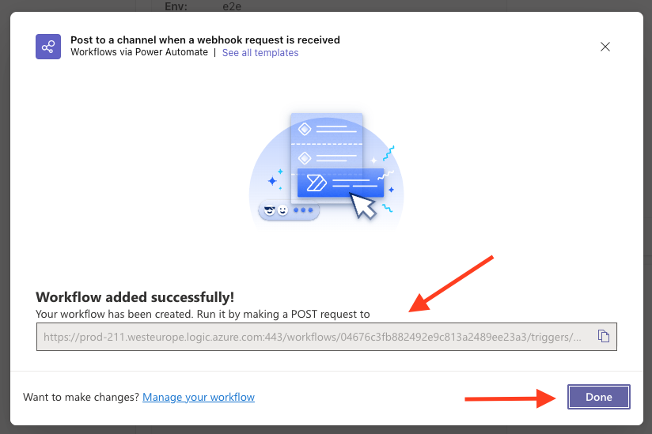

# Teams notifications

This action send a notification to MS Teams using the workflows.

## How create the workflow

 - Step 1 - Click on "3 dots" and then "Workflows"
 >
 - Step 2 - Select "Post to a channel when a webhook request is received"
 >
 - Step 3 - Added the name of the workflow and then click "next"
 >
 - Step 4 - Click "Add workflow"
 >
 - Step 5 - Here the workflow is created with success and is possible pcpy the url.
 >
 - Step 6 - Repeat the Step 1
 >
 - Step 7 - Click on "Manage"
 >
 - Step 8 - Click on the name of the created workflow
 >
 - Step 9 - Click "Edit"
 >
 - Step 10 - Click "Send each adaptive card"
 >
 - Step 11 - Click "Post card in a chat or channel"
 >
 - Step 12 - Validate if the field "Post as" values is "User" if not, select it.
 >
 - Step 13 - Click "Save"
 >

## How create the notification template.
 
Access the https://adaptivecards.io/designer/ and create the template.

If you have the template, you add it theere and change/validate the template.